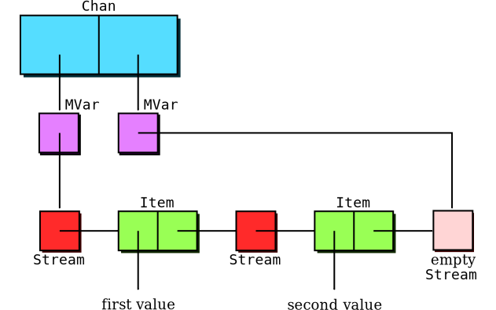

# [Foreign function interface][FFI] (FFI)

* Can import foreign functions like this:

    ~~~~ {.haskell}
    foreign import ccall unsafe "stdlib.h malloc"
        c_malloc :: CSize -> IO (Ptr a)
    foreign import ccall unsafe "stdlib.h free"
        c_free :: Ptr a -> IO ()
    ~~~~

    * `ccall` says use C calling convention (also `cplusplus` and few
      others)
    * `unsafe` promises the C function will not call back into
      Haskell
    * `unafe` faster than `safe`, but gives undefined results if call
      triggers GC
* Spec for import string: `"`[`static`] [*c-header*] [`&`][*c-name*]`"`
    * `static` optional unless *c-name* is `dynamic` or `wrapper`
    * *c-header* is a single `.h` file with the declaration
       (ignored by GHC)
    * "&" imports pointer rather than function (required for `FunPtr`s)
* See [language spec][FFI] for other FFI features
    * Call C function pointers or turn Haskell functions into C
      function pointers
    * Export Haskell functions for static linking to C code

# FFI types

* FFI function arguments must be *basic foreign types*
    * `Char`, `Int`, `Double`, `Float`, `Bool`, `Int8`, `Int16`,
      `Int32`, `Int64`, `Word8`, `Word16`, `Word32`, `Word64`, `Ptr`
      `a`, `FunPtr a`, and `StablePtr a`
    * Also accepts any `type` or `newtype` wrappers for basic types
      (`CInt`, `CChar`, etc.) 
      [Documentation incorrectly says `data CInt`, but `:i` in GHCI
      reveals truth.]
* FFI function results can be
    * Any valid argument type
    * `()` (for functions returning `void`)
    * `IO a` where `a` is either of the above two
* Place result in `IO` if function has side effects or non-determinism
    * Okay to omit if it is a pure C function:

        ~~~~ {.haskell}
        foreign import ccall unsafe "arpa/inet.h ntohl"
            ntohl :: Word32 -> Word32
        ~~~~

    * Haskell can't check C purity, so omitting `IO` can cause
      problems

# [`hsc2hs`][hsc2hs]

* How to access C constants and data structures?

    ~~~~ {.c}
    struct mystruct {
      char *name;
      int value;
    };
    ~~~~

    * Might model with opaque placeholder type

    ~~~~ {.haskell}
    data MyStruct           -- no constructors, just a placeholder
    getValue :: Ptr MyStruct -> IO CInt
    getValue ptr = peek $ ptr `plusPtr` 8 -- breaks on 32-bit arch
    ~~~~

* [`hsc2hs`][hsc2hs] is pre-processor that lets you compute C values

    ~~~~ {.haskell}
    #include "myheader.h"
    getValue ptr = peek $ ptr `plusPtr`
                   #{offset struct mystruct, value}
    ~~~~

    * Super-simple implementation just uses C macros and `printf`
    * Find the file [`template-hsc.h`][template-hsc.h] on your system
      to see defs of `#` commands
    * Can also define your own macros with `#let` (like `#define` w/o
      parens)

# Exceptions

* We've seen a few functions that "return" any type

    ~~~~ {.haskell}
    undefined :: a
    error :: String -> a
    ~~~~

    * Return type can be arbitrary because function doesn't actually
      return

* These functions throw *language-level* exceptions

    * To use exceptions directly, import [`Control.Exception`] as
      follows:

    ~~~~ {.haskell}
    import Prelude hiding (catch)
    import Control.Exception
    ~~~~

    * `Prelude` has an old, less general version of `catch` you should
	avoid 
	(`hiding` keyword prevents import of specific symbols)

    * [`Control.Exception`] gives you access to the following
      symbols:

    ~~~~ {.haskell}
    class (Typeable e, Show e) => Exception e where ...
    throw :: Exception e => e -> a
    throwIO :: Exception e => e -> IO a
    catch   :: Exception e => IO a -> (e -> IO a) -> IO a
    ~~~~

# Simple example

~~~~ {.haskell}
{-# LANGUAGE DeriveDataTypeable #-}

import Prelude hiding (catch)
import Control.Exception
import Data.Typeable

data MyError = MyError String deriving (Show, Typeable)
instance Exception MyError

catcher :: IO a -> IO (Maybe a)
catcher action = fmap Just action `catch` handler
    where handler (MyError msg) = do putStrLn msg; return Nothing
~~~~

~~~~
*Main> catcher $ readFile "/dev/null"
Just ""
*Main> catcher $ throwIO $ MyError "something bad"
something bad
Nothing
~~~~

* Need `DeriveDataTypeable` language pragma (later lecture)
* `handler`'s type cannot be inferred (use constructor or type
  signature)
    * Constructor pattern `e@(SomeException _)` catches all exceptions

# Exceptions in pure code

* Previous example wrapped `catcher` around an IO action
* Can `throw` exceptions in pure code, yet `catch` them only in `IO`
    * This is because evaluation order depends on implementation
    * Which error is thrown by `(error "one") + (error "two")`? 
      Can be non-deterministic, which is [okay][imprecise exceptions]
      if `catch` is restricted to the `IO` Monad
* In `IO`, use `throwIO` (not `throw`) to make exception sequencing
  precise

    ~~~~ {.haskell}
        do x <- throwIO (MyError "one")  -- this exception thrown
           y <- throwIO (MyError "two")  -- this code not reached
    ~~~~

* Beware `catch` only catches exceptions if code actually evaluated

    ~~~~ {.haskell}
    pureCatcher :: a -> IO (Maybe a)
    pureCatcher a = (a `seq` return (Just a))
                    `catch` \(SomeException _) -> return Nothing
    ~~~~

    ~~~~
    *Main> pureCatcher (undefined :: String)
    Nothing
    *Main> pureCatcher (undefined:undefined :: String)
    Just "*** Exception: Prelude.undefined
    ~~~~

# A few more exception functions

* `try` returns `Right a` normally, `Left e` if an exception occurred

    ~~~~ {.haskell}
    try :: Exception e => IO a -> IO (Either e a)
    ~~~~

* `finally` and `onException` run an clean-up action

    ~~~~ {.haskell}
    finally :: IO a -> IO b -> IO a      -- cleanup always
    onException :: IO a -> IO b -> IO a  -- after exception
    ~~~~

    * Result of cleanup action (`b`) is discarded

* `catchJust` catches only exceptions matching a predicate on value

    ~~~~ {.haskell}
    catchJust :: Exception e =>
                 (e -> Maybe b) -> IO a -> (b -> IO a) -> IO a

    readFileIfExists f = catchJust p (readFile f) (\_ -> return "")
      where p e = if isDoesNotExistError e then Just e else Nothing
    ~~~~

    ~~~~
    *Main> readFileIfExists "/nosuchfile"
    ""
    *Main> readFileIfExists "/etc/shadow"
    *** Exception: /etc/shadow: openFile: permission denied ...
    ~~~~

# Monadic exceptions

* Language-level exceptions can be cumbersome for non-`IO` actions
    * Non-determinism is annoying
    * Often want to detect error without assuming the `IO` monad
    * Monads built on top of `IO` also can't catch exceptions

* Often it is better to implement error handling in the Monad
    * Recall the `Maybe` Monad, where can use `Nothing` to indicate
      failure

    ~~~~ {.haskell}
    instance  Monad Maybe  where
        (Just x) >>= k = k x
        Nothing  >>= _  = Nothing
        return = Just
        fail _ = Nothing
    ~~~~

    * Note `fail` method called when bind pattern matches fail in `do`
      block

    ~~~~ {.haskell}
    *Main> (do 1 <- return 2; return 3) :: Maybe Int
    Nothing
    ~~~~

# Haskell threads

* Haskell implements user-level threads in [`Control.Concurrent`]

    * Threads are lightweight (in both time and space)
    * Use threads where in other languages would use cheaper constructs
    * Runtime emulates blocking OS calls in terms of non-blocking ones
    * Thread-switch can happen any time GC could be invoked

* `forkIO` call creates a new thread:

    ~~~~ {.haskell}
    forkIO :: IO () -> IO ThreadId    -- creates a new thread
    ~~~~

* A few other very useful thread functions:

    ~~~~ {.haskell}
    throwTo :: Exception e => ThreadId -> e -> IO ()
    killThread :: ThreadId -> IO ()   -- = flip throwTo ThreadKilled
    threadDelay :: Int -> IO ()       -- sleeps for # of µsec
    myThreadId :: IO ThreadId
    ~~~~

# Example: timeout

* Execute `IO` action, or abort after # of µsec
    * [`System.Timeout`] has a slightly better version of this function

~~~~ {.haskell}
newtype TimedOut = TimedOut UTCTime deriving (Eq, Show, Typeable)
instance Exception TimedOut

timeout :: Int -> IO a -> IO (Maybe a)
timeout usec action = do
  -- Create unique exception val (for nested timeouts):
  expired <- fmap TimedOut getCurrentTime

  ptid <- myThreadId
  let child = do threadDelay usec
                 throwTo ptid expired
      parent = do ctid <- forkIO child
                  result <- action
                  killThread ctid
                  return $ Just result
  catchJust (\e -> if e == expired then Just e else Nothing) 
            parent
            (\_ -> return Nothing)
~~~~

# [`MVar`s][`MVar`]

* The [`MVar`] type lets threads communicate via shared variables

    * An `MVar t` is a mutable variable of type `t` that is either
      *full* or *empty*

    ~~~~ {.haskell}
    newEmptyMVar :: IO (MVar a)  -- create empty MVar
    newMVar :: a -> IO (MVar a)  -- create full MVar given val

    takeMVar :: MVar a -> IO a
    putMVar :: MVar a -> a -> IO ()
    ~~~~

    * If an `MVar` is full, `takeMVar` makes it empty and returns
      former contents
    * If an `MVar` is empty, `putMVar` fills it with a value
    * Taking an empty `MVar` or putting a full one puts thread to
      sleep until `MVar` becomes available
    * Only one thread awakened at a time if several blocked on same
      `MVar`
    * There are also non-blocking versions of `MVar` calls

    ~~~~ {.haskell}
    tryTakeMVar :: MVar a -> IO (Maybe a) -- Nothing if empty
    tryPutMVar :: MVar a -> a -> IO Bool  -- False if full
    ~~~~

# Example: pingpong benchmark

~~~~ {.haskell}
import Control.Concurrent
import Control.Exception
import Control.Monad

pingpong :: Bool -> Int -> IO ()
pingpong v n = do
  mvc <- newEmptyMVar
  mvp <- newEmptyMVar
  let parent n | n > 0 = do when v $ putStr $ " " ++ show n
                            putMVar mvc n
                            takeMVar mvp >>= parent
             | otherwise = return ()
      child = do n <- takeMVar mvc
                 putMVar mvp (n - 1)
                 child
  tid <- forkIO child
  parent n `finally` killThread tid
  when v $ putStrLn ""
~~~~

~~~~
*Main> pingpong True 10
 10 9 8 7 6 5 4 3 2 1
~~~~

# Sidenote: benchmarking

* Bryan has a kick-ass benchmarking library
  [criterion](http://hackage.haskell.org/package/criterion)

~~~~ {.haskell}
import Criterion.Main

...

main :: IO ()
main = defaultMain [
        bench "thread switch test" mybench
       ]
    where mybench = pingpong False 10000
~~~~

~~~~
$ ghc -O pingpong.hs 
[1 of 1] Compiling Main             ( pingpong.hs, pingpong.o )
Linking pingpong ...
$ ./pingpong 
...
benchmarking thread switch test
mean: 3.782984 ms, lb 3.770838 ms, ub 3.798160 ms, ci 0.950
std dev: 69.27807 us, lb 55.00853 us, ub 88.83503 us, ci 0.950
~~~~

* ~3.8 msec for 20,000 thread switches = ~190 nsec/switch

# OS threads

* GHC also has *two* versions of the haskell runtime
    * By default, all Haskell threads run in a single OS thread
    * Link with `-threaded` to allow OS threads (`pthread_create`) as well
* `forkOS` call creates Haskell thread *bound* to a new OS thread

    ~~~~ {.haskell}
    forkOS :: IO () -> IO ThreadId
    ~~~~

* Also, when linked with `-threaded`, initial thread is bound
* Whoa... what happened? `-threaded` 30 times slower?

~~~~
$ rm pingpong
$ ghc -threaded -O pingpong.hs 
Linking pingpong ...
$ ./pingpong
...
mean: 113.6852 ms, lb 113.5195 ms, ub 113.8770 ms, ci 0.950
std dev: 912.0979 us, lb 731.0661 us, ub 1.226794 ms, ci 0.950
~~~~

# Bound vs. unbound threads

* Without `-threaded`, all Haskell threads run in one OS thread
    * Thread switch is basically just a procedure call, i.e. super-fast

* `-threaded` introduces multiple OS-level threads
    * Some Haskell threads are *bound* to a particular OS thread
    * *Unbound* Haskell threads share (and migrate between) OS threads
    * `unbound` haskell threads have same performance as w/o
      `-threaded`

* Initial thread bound, so we were actually benchmarking Linux
    * Can wrap parent thread in `forkIO` to make it unbound

    ~~~~ {.haskell}
    wrap :: IO a -> IO a
    wrap action = do
      mv <- newEmptyMVar
      _ <- forkIO $ (action >>= putMVar mv) `catch`
           \e@(SomeException _) -> putMVar mv (throw e)
      takeMVar mv
    ~~~~

    * But library has better function
      [`runInUnboundThread`](http://hackage.haskell.org/packages/archive/base/latest/doc/html/Control-Concurrent.html#v:runInUnboundThread)

# What good are OS threads?

* If an unbound thread blocks, can block whole program
    * Unix runtime tries to avoid blocking syscalls, but can't avoid
      blocking for things like file system IO and paging
    * With `-threaded`, GHC ensures `safe` FFI calls run in separate
      OS thread
    * `unsafe` FFI calls from unbound threads can block other threads
* FFI functions may expect to be called from same thread
    * E.g., foreign code using `pthread_getspecific` can get confused
      if called from a migrated unbound thread
* May want to override scheduler and run on particular CPU
    * E.g., see
      [`forkOn`](http://hackage.haskell.org/packages/archive/base/latest/doc/html/Control-Concurrent.html#v:forkOn)

# Asynchronous exceptions

* Some handy `MVar` utility functions for updating a value

    ~~~~ {.haskell}
    modifyMVar :: MVar a -> (a -> IO (a, b)) -> IO b
    modifyMVar_ :: MVar a -> (a -> IO a) -> IO ()
    ~~~~

    * E.g., "`modifyMVar x (\n -> return (n+1, n))`" like "`x++`" in C

* How would you implement `modifyMVar`?

    ~~~~ {.haskell}
    modifyMVar :: MVar a -> (a -> IO (a,b)) -> IO b
    modifyMVar m action = do
      v0 <- takeMVar m
      (v, r) <- action v0 `onException` putMVar m v0
      putMVar m v
      return r
    ~~~~

    * Anyone see a problem?  (Hint: remember `throwTo`, `killThread`)

# Asynchronous exceptions

* Some handy `MVar` utility functions for updating a value

    ~~~~ {.haskell}
    modifyMVar :: MVar a -> (a -> IO (a, b)) -> IO b
    modifyMVar_ :: MVar a -> (a -> IO a) -> IO ()
    ~~~~

    * E.g., "`modifyMVar x (\n -> return (n+1, n))`" like "`x++`" in C

* How would you implement `modifyMVar`?

    ~~~~ {.haskell}
    modifyMVar :: MVar a -> (a -> IO (a,b)) -> IO b
    modifyMVar m action = do
      v0 <- takeMVar m -- -------------- oops, race condition
      (v, r) <- action v0 `onException` putMVar m v0
      putMVar m v
      return r
    ~~~~

    * What if another thread calls `killThread` on the current thread
      while current thread between `takeMVar` and `onException`
    * `timeout` and `wrap` functions from a few slides ago have same
      problem

# Masking exceptions

* The
  [`mask`](http://hackage.haskell.org/packages/archive/base/latest/doc/html/Control-Exception.html#v:mask)
  function can sidestep such race conditions

    ~~~~ {.haskell}
    mask :: ((forall a. IO a -> IO a) -> IO b) -> IO b
    ~~~~

    * This is a funny type signature--uses an extension called
      `RankNTypes`.  For now, ignore "`forall a.`"--just makes
      function more flexible
    * `mask $ \f -> b` runs action `b` with asynchronous exceptions
      *masked*
    * Function `f` allows exceptions to be *unmasked* again for an
      action
    * Exceptions are also unmasked if thread sleeps (e.g., in
      `takeMVar`)

* Example:  Fixing `modifyMVar`

    ~~~~ {.haskell}
    modifyMVar :: MVar a -> (a -> IO (a,b)) -> IO b
    modifyMVar m action = mask $ \unmask -> do
      v0 <- takeMVar m -- automatically unmasked while waiting
      (v, r) <- unmask (action v0) `onException` putMVar m v0
      putMVar m v
      return r
    ~~~~

# Masking exceptions (continued)

* `forkIO` preserves the current mask state
    * Can use the `unmask` function in child thread

* Example: fixed `wrap` function

~~~~ {.haskell}
wrap :: IO a -> IO a          -- Fixed version of wrap
wrap action = do
  mv <- newEmptyMVar
  mask $ \unmask -> do
      tid <- forkIO $ (unmask $ action >>= putMVar mv) `catch`
             \e@(SomeException _) -> putMVar mv (throw e)
      let loop = takeMVar mv `catch` \e@(SomeException _) ->
                 throwTo tid e >> loop
      loop
~~~~

* Note we don't call `unmask` in parent thread
    * `loop` will sleep on `takeMVar`, which implicitly unmasks
    * Unmask while sleeping is generally what you want, but can avoid
      with
      [uninterruptibleMask](http://hackage.haskell.org/packages/archive/base/latest/doc/html/Control-Exception.html#v:uninterruptibleMask)

# The [`bracket`] function

* `mask` is tricky, but library function [`bracket`] simplifies use

    ~~~~ {.haskell}
    bracket :: IO a -> (a -> IO b) -> (a -> IO c) -> IO c
    ~~~~

* Example: process file without leaking handle

    ~~~~ {.haskell}
    bracket (openFile "/etc/mtab" ReadMode) -- first
            hClose                          -- last
            (\h -> hGetContents h >>= doit) -- main
    ~~~~

* Example: fix `parent` function from our `timeout` example

    ~~~~ {.haskell}
      parent = do ctid <- forkIO child             -- old code,
                  result <- action                 -- bad if async
                  killThread ctid                  -- exception
                  return $ Just result
    ~~~~

    ~~~~ {.haskell}
      parent = bracket (forkIO child) killThread $ -- new code
               \_ -> fmap Just action
    ~~~~

# Working with `MVar`s

* `MVar`s work just fine as a mutex:

    ~~~~ {.haskell}
    type Mutex = MVar ()

    mutex_create :: IO Mutex
    mutex_create = newMVar ()

    mutex_lock, mutex_unlock :: Mutex -> IO ()
    mutex_lock = takeMVar
    mutex_unlock mv = putMVar mv ()

    mutex_synchronize :: Mutex -> IO a -> IO a
    mutex_synchronize mv action =
        bracket (mutex_lock mv) (\_ -> mutex_unlock mv)
                    (\_ -> action)
    ~~~~

* Note anyone can unlock a `Mutex` if it is locked
    * How would you throw assertion failure if caller doesn't hold lock?

# Alternate `Mutex`

* Use *full* `MVar` rather than empty to mean lock held

    ~~~~ {.haskell}
    type Mutex = MVar ThreadId

    mutex_create :: IO Mutex
    mutex_create = newEmptyMVar

    mutex_lock, mutex_unlock :: Mutex -> IO ()

    mutex_lock mv = myThreadId >>= putMVar mv

    mutex_unlock mv = do mytid <- myThreadId
                         lockTid <- tryTakeMVar mv
                         unless (lockTid == Just mytid) $
                             error "mutex_unlock"
    ~~~~

    * Store `ThreadId` of lock owner in `MVar`

* How would you implement a condition variable?
    * Many uses of condition variables don't work with async
      exceptions
    * So let's not worrying about `mask` for this question...

# Condition variables

~~~~ {.haskell}
data Cond = Cond Mutex (MVar [MVar ()])

cond_create :: Mutex -> IO Cond
cond_create m = do
  waiters <- newMVar []
  return $ Cond m waiters

cond_wait, cond_signal, cond_broadcast :: Cond -> IO ()
cond_wait (Cond m waiters) = do
  me <- newEmptyMVar
  modifyMVar_ waiters $ \others -> return $ others ++ [me]
  mutex_unlock m   -- note we don't care if preempted here after this
  takeMVar me `finally` mutex_lock m
  
cond_signal (Cond _ waiters) = modifyMVar_ waiters wakeone
    where wakeone [] = return []
          wakeone (w:ws) = putMVar w () >> return ws

cond_broadcast (Cond _ waiters) = modifyMVar_ waiters wakeall
    where wakeall ws = mapM_ (flip putMVar ()) ws >> return []
~~~~

* Key idea: putting `MVar`s inside `MVar`s is very powerful

# Channels

* [`Control.Concurrent.Chan`] provides unbounded *channels*
    * Implemented as two `MVar`s -- for read and and write end of `Stream`

    ~~~~ {.haskell}
    data Item a = Item a (Stream a)
    type Stream a = MVar (Item a)
    data Chan a = Chan (MVar (Stream a)) (MVar (Stream a))
    ~~~~

# Channel implementation [simplified]

~~~~ {.haskell}
data Item a = Item a (Stream a)
type Stream a = MVar (Item a)
data Chan a = Chan (MVar (Stream a)) (MVar (Stream a))

newChan :: IO (Chan a)
newChan = do
  empty <- newEmptyMVar
  liftM2 Chan (newMVar empty) (newMVar empty)

writeChan :: Chan a -> a -> IO ()
writeChan (Chan _ w) a = do
  empty <- newEmptyMVar
  modifyMVar_ w $ \oldEmpty -> do
    putMVar oldEmpty (Item a empty)
    return empty

readChan :: Chan a -> IO a
readChan (Chan r _) =
    modifyMVar r $ \full -> do
      (Item a newFull) <- takeMVar full
      return (newFull, a)
~~~~

# Networking

* Haskell provides basic socket support in [`Network.Socket`]
    * Patterned after BSD sockets

    ~~~~ {.haskell}
    socket :: Family -> SocketType -> ProtocolNumber -> IO Socket
    connect :: Socket -> SockAddr -> IO ()
    bindSocket :: Socket -> SockAddr -> IO ()
    listen :: Socket -> Int -> IO ()
    accept :: Socket -> IO (Socket, SockAddr)
    ~~~~

    * [`getAddrInfo`](http://hackage.haskell.org/packages/archive/network/latest/doc/html/Network-Socket.html#v:getAddrInfo)
looks up hostnames just like [[RFC3493]][RFC3493] (returns 
      `[`[`AddrInfo`](http://hackage.haskell.org/packages/archive/network/latest/doc/html/Network-Socket.html#t:AddrInfo)`]`)

    ~~~~ {.haskell}
    getAddrInfo :: Maybe AddrInfo
                -> Maybe HostName -> Maybe ServiceName
                -> IO [AddrInfo]
    ~~~~

    * Example: Get `SockAddr` for talking to web server:

    ~~~~ {.haskell}
    webServerAddr :: String -> IO SockAddr
    webServerAddr name = do
      addrs <- getAddrInfo Nothing (Just name) (Just "www")
      return $ addrAddress $ head $ addrs
    ~~~~

# Example: netcat

~~~~ {.haskell}
netcat :: String -> String -> IO ()
netcat host port = do
  -- Extract address from first AddrInfo in list
  AddrInfo{addrAddress = addr}:_
      <- getAddrInfo Nothing (Just host) (Just port)

  -- Create a TCP socket connected to server
  s <- socket AF_INET Stream 0
  connect s addr

  -- Convert socket to handle
  h <- socketToHandle s ReadWriteMode
  hSetBuffering h NoBuffering  -- THIS IS IMPORTANT

  -- Deal w. broken unicode
  hSetBinaryMode stdout True

  -- Copy data back and forth
  done <- newEmptyMVar
  forkIO $ (hGetContents h >>= putStr) `finally` putMVar done ()
  getContents >>= hPutStr h
  takeMVar done
~~~~

[FFI]: http://www.haskell.org/onlinereport/haskell2010/haskellch8.html
[hsc2hs]: http://www.haskell.org/ghc/docs/latest/html/users_guide/hsc2hs.html
[template-hsc.h]: http://darcs.haskell.org/cgi-bin/gitweb.cgi?p=hsc2hs.git;a=blob;f=template-hsc.h;hb=HEAD
[imprecise exceptions]: http://research.microsoft.com/en-us/um/people/simonpj/papers/imprecise-exn.htm
[`Control.Exception`]: http://hackage.haskell.org/packages/archive/base/latest/doc/html/Control-Exception.html
[`Control.Concurrent`]: http://hackage.haskell.org/packages/archive/base/latest/doc/html/Control-Concurrent.html
[`Control.Concurrent.Chan`]: http://hackage.haskell.org/packages/archive/base/latest/doc/html/Control-Concurrent-Chan.html
[`Network.Socket`]: http://hackage.haskell.org/packages/archive/network/latest/doc/html/Network-Socket.html
[`System.Timeout`]: http://hackage.haskell.org/packages/archive/base/latest/doc/html/System-Timeout.html
[`MVar`]: http://hackage.haskell.org/packages/archive/base/latest/doc/html/Control-Concurrent-MVar.html
[`bracket`]: http://hackage.haskell.org/packages/archive/base/latest/doc/html/Control-Exception.html#v:bracket
[RFC3493]: http://tools.ietf.org/html/rfc3493
